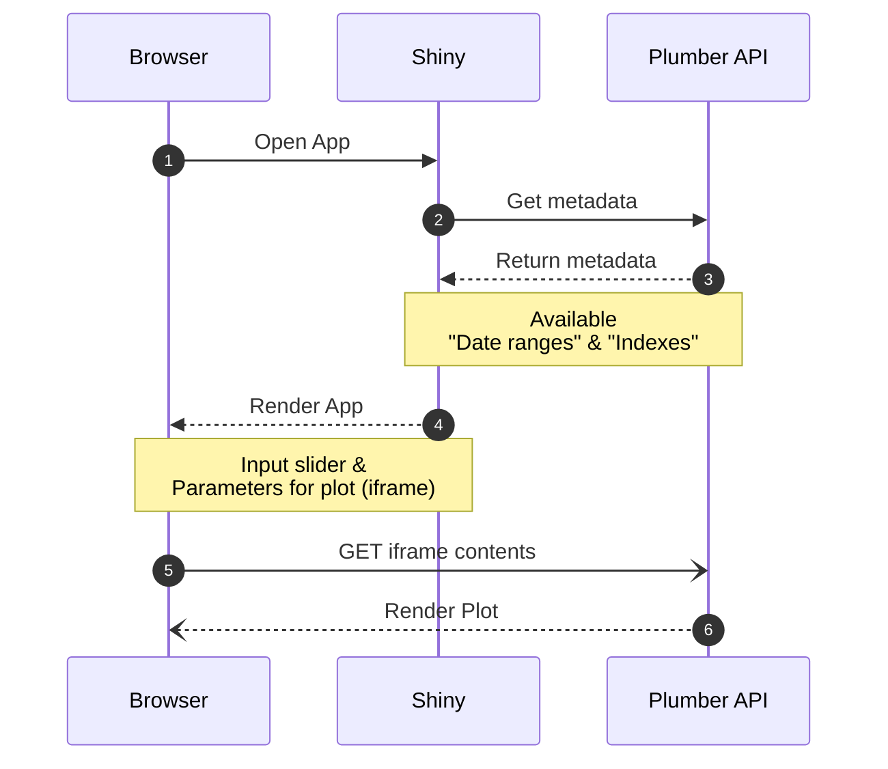

## Plumber Example

> Plumber API paired with a Shiny App that displays data and plots renders in API

The Plumber API implemented in this repository is a simple wrapper over the `EuStockMarkets` dataset allowing to query and plot this dataset.

It shows the potential usages of Plumber by creating a REST api that is async _(handles multiple requests in parallel)_ and caches the results.

#### Endpoints

  - `/plot` :: returns HTML that can be embedded in a Web page
  - `/query` :: returns the data that supports the plot
  - `/ranges` :: returns metadata for the available date ranges
  - `/indexes` :: returns metadata that provides the available indexes in the data

#### Plumber technical features:

- Using `{future}` to allow for async responses
- Using `{memoise}` to allow for caching of the results
  - re-using the results cache on following request with same parameters

#### Security

The example also implements a origin validation check when configured.
A secret key shared known only to the Plumber API and the client allows the creation of a token that validates that the requests originated from a trusted source.

The example Plumber API is deployed via the Posit Connect infrastructure, which ensures that the traffic is encrypted behind the HTTPS protocol.

#### Load Balancing

Multiple instances of the Plumber API can be run behind a load balancer to provide with more capacity to a stateless service.

For example, this can be achieved via a `Docker`-based solution `haproxy`.

#### Example links

Note: it needs `connect.appsilon.com` creadentials.

API documentation: https://connect.appsilon.com/plumber-example/
Shiny example (see below): https://connect.appsilon.com/plumber-example-shiny/
Sample plot: https://connect.appsilon.com/plumber-example/plot?from=1990-01-01&to=2000-01-01
Sample metadata _(date ranges)_: https://connect.appsilon.com/plumber-example/ranges

#### Shiny _(paired with Plumber)_

The Shiny application 

- Calls Plumber API to retrieve metadata
- Plot is rendered by the browser (bypassing Shiny server)
  - Using an `iframe` HTML element _(browser calls on Plumber API endpoint and renders it)_
  - Shiny process is not blocked by the rendering of the plot

