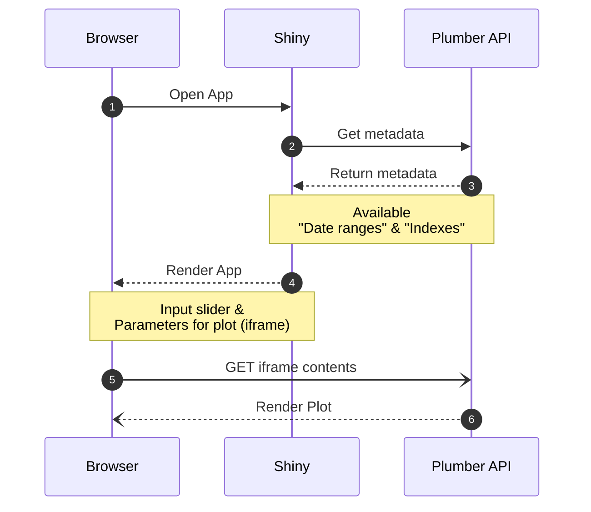

## Plumber Example

> Plumber API paired with a Shiny App that displays data and plots renders in API

The Plumber API implemented in this repository is a simple wrapper over the `EuStockMarkets` dataset allowing to query and plot this dataset.

It shows the potential usages of Plumber by creating a REST api that is async _(handles multiple requests in parallel)_ and caches the results.

Using plumber API to handle queries for:
- Metadata _(available range of dates and indexes)_
- Data
- Plot rendering

#### Plumber technical features:

- Using `{future}` to allow for async responses
- Using `{memoise}` to allow for caching of the results
  - re-using the results cache on following request with same parameters

#### Endpoints

  - `/plot` :: returns HTML that can be embedded in a Web page
  - `/query` :: returns the data that supports the plot
  - `/ranges` :: returns metadata for the available date ranges
  - `/indexes` :: returns metadata that provides the available indexes in the data

#### Shiny _(paired with Plumber)_

- Calls Plumber API to retrieve metadata
- Plot is rendered by the browser (bypassing Shiny server)
  - Using an `iframe` HTML element _(browser calls on Plumber API endpoint and renders it)_
  - Shiny process is not blocked by the rendering of the plot
